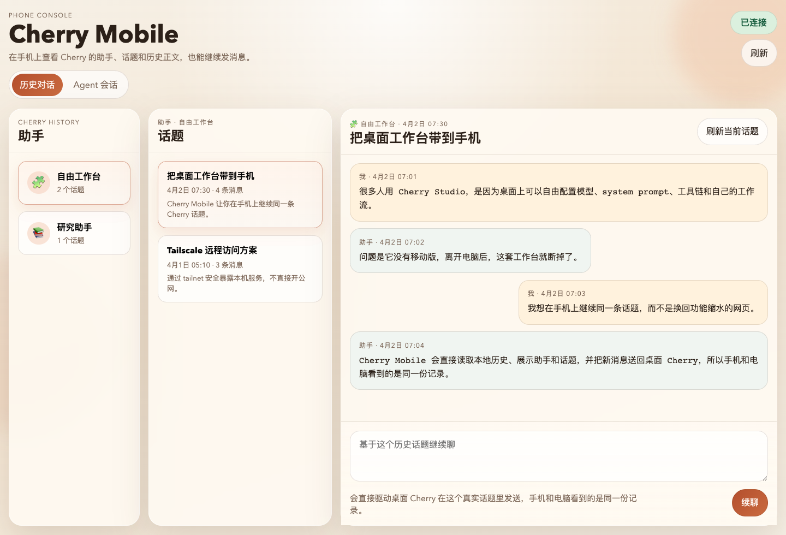
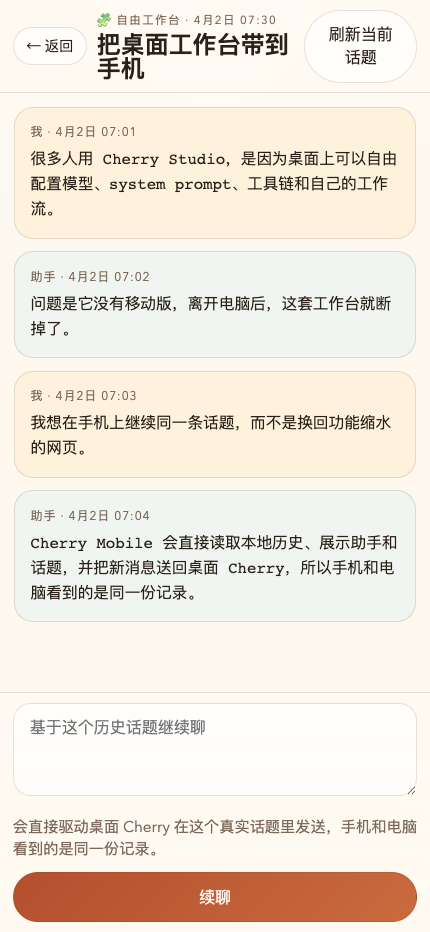
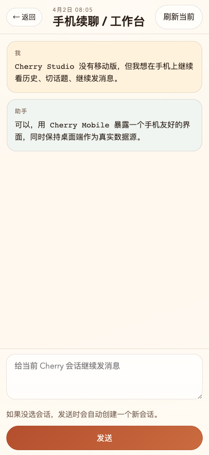

# Cherry Mobile

[](https://opensource.org/licenses/MIT)
[](https://www.python.org/downloads/)
[](https://www.apple.com/macos/)

**Use [Cherry Studio](https://github.com/CherryHQ/cherry-studio) from your phone.** Browse assistants, read real conversation history, and continue chatting — all through a self-hosted mobile web UI that talks directly to your desktop Cherry installation.

**在手机上使用 [Cherry Studio](https://github.com/CherryHQ/cherry-studio)。** 浏览助手、查看真实对话历史、继续聊天 — 通过一个自托管的移动端 Web UI 直接连接你桌面上的 Cherry。

Created by 花花虫.

---

**[English](#english)** | **[中文](#中文)**

---

<a id="english"></a>

## English

Cherry Studio gives power users a free-form desktop shell for custom models, system prompts, and tool chains. But it has no mobile version — leave your desk and that entire setup disappears. Cherry Mobile keeps it in your pocket.

It is a self-hosted bridge, not an official Cherry Studio plugin:

- Cherry Studio stays the source of truth on your Mac
- Cherry Mobile reads its local data directly
- A phone-friendly web UI is exposed on your local network or tailnet
- Messages sent from your phone flow back into the real Cherry workflow

### What You Can Do

**1. Browse Real Cherry History** — List assistants and their topics, open full message history, poll for updates so new replies appear on phone shortly after they land on desktop.

**2. Continue a Real Topic From Phone** — Select an existing topic, type a follow-up, Cherry Mobile sends it back into the same underlying Cherry workflow. If desktop automation succeeds, the message appears natively inside Cherry Studio.

**3. Use Live Agent Sessions** — List agents exposed by Cherry's local API, browse recent sessions, create a new mobile session, continue a live session from the phone UI.

**4. Run It Like a Personal Tool** — Works behind `localhost`, LAN, or Tailscale. Session-cookie auth. Installable as a PWA. Optimized for one-user, self-hosted usage.

### Quick Setup for Mobile Access

1. **Install [Tailscale](https://tailscale.com/)** on both your Mac and your phone. Log in to the same tailnet.
2. **Start Cherry Mobile** on your Mac:
   ```bash
   npm install
   python3 -m venv .venv && source .venv/bin/activate
   mkdir -p log data
   python3 server.py
   ```
3. **Expose it over Tailscale:**
   ```bash
   tailscale serve --bg --https=8443 http://127.0.0.1:8765
   ```
4. **Open on your phone:** `https://<your-mac>.ts.net:8443` — add to home screen for PWA mode.

That's it. No port forwarding, no cloud hosting, no public exposure.

### Language

The app supports **English** and **Chinese (中文)** with an in-app language toggle. The interface defaults to English but can be switched at any time.

### Screenshots

<p align="center">
  
</p>

<p align="center">
  
  
</p>

### End-to-End Flow

1. Cherry Studio runs on your Mac as usual.
2. Cherry Mobile reads Cherry's IndexedDB and local storage to build a history tree.
3. You open the mobile web app from your phone.
4. You browse an assistant, open a topic, and read messages.
5. When you send a follow-up, Cherry Mobile drives the real Cherry desktop UI through macOS accessibility.
6. If the UI path is unavailable, it falls back to Cherry's local API.
7. The phone UI keeps polling and updates as the topic changes.

This is not a fake mirror chat. The goal is to stay attached to the real Cherry installation and its real data.

### Architecture

```text
Phone Browser ──HTTPS──> Tailscale Serve / Reverse Proxy ──> Cherry Mobile Server
                                                              │
                                              ┌───────────────┼───────────────┐
                                              │               │               │
                                              v               v               v
                                      Parse IndexedDB   Drive Desktop UI   Proxy Cherry API
                                      + Local Storage    via AX APIs        (port 23333)
```

| File | Language | Role |
|---|---|---|
| `server.py` | Python | HTTP server, auth, API proxy, async send pipeline, topic continuation |
| `cherry_history.py` | Python | Parses Cherry Studio's Chromium IndexedDB / LevelDB data |
| `cherry_ui.swift` | Swift | macOS accessibility APIs to control Cherry Studio's UI |
| `extract_persist.js` | Node.js | Reads persisted local storage state from Cherry's LevelDB |
| `static/` | HTML/JS/CSS | Mobile-first SPA, history browser, live session UI, PWA shell |

### How It Works Internally

**History Extraction** — Cherry Studio stores state in Chromium-managed local storage and IndexedDB files. Cherry Mobile reads those files directly: scan `.ldb` and `.log` files, decode mixed binary structures, reconstruct assistants/topics/messages/blocks, tolerate storage noise and partial records. This is the hardest part of the project.

**Message Sending** — Two paths: (1) preferred — drive the actual Cherry Studio desktop UI with macOS accessibility APIs; (2) fallback — proxy selected Cherry API endpoints. The UI-driven path preserves the feeling of "I am still using Cherry itself".

**Sync Model** — Periodic polling, live session loading through Cherry's local API, optimistic pending state while a send is in flight. No websocket-heavy architecture — for a personal tool, polling is simpler and reliable enough.

### Security Model

Designed for trusted personal environments, not for open internet exposure.

**What it does:** session cookies, auth for `/api/*`, overridable session token, proxy restricted to specific upstream paths.

**What it does not try to be:** multi-user SaaS, hardened public auth, generic reverse proxy.

**Recommended:** bind to `127.0.0.1`, publish through Tailscale Serve, do not expose directly to the public internet.

### Requirements

- macOS (required for desktop automation)
- Cherry Studio installed and running
- Cherry Studio local API enabled (for live agent mode / API fallback)
- Python 3.11+
- Node.js
- Accessibility permission granted to the process running Cherry Mobile

### Environment Variables

| Variable | Default | Description |
|---|---|---|
| `CHERRY_MOBILE_HOST` | `127.0.0.1` | Listen host |
| `CHERRY_MOBILE_PORT` | `8765` | Listen port |
| `CHERRY_BASE_URL` | `http://127.0.0.1:23333` | Cherry Studio local API base URL |
| `CHERRY_MOBILE_SESSION_TOKEN` | random at startup | Fixed session token for browser auth |
| `CHERRY_MOBILE_MAX_BODY_BYTES` | `1048576` | Maximum request body size |
| `CHERRY_API_KEY` | unset | Optional manual override for Cherry API key |

### Limitations

- macOS is required for the desktop automation path
- Cherry storage formats and local APIs may change upstream
- Assumes a single trusted operator
- Remote use is safest through Tailscale or another private tunnel

---

<a id="中文"></a>

## 中文

Cherry Studio 让重度用户在桌面端自由配置自定义模型、系统提示词和工具链，但它没有移动版 — 离开电脑就用不了。Cherry Mobile 让你把它装进口袋。

这是一个自托管桥接工具，不是 Cherry Studio 官方插件：

- Cherry Studio 仍然是你 Mac 上的数据源
- Cherry Mobile 直接读取它的本地数据
- 通过局域网或 Tailscale 暴露一个手机友好的 Web UI
- 从手机发的消息会回到真实的 Cherry 工作流

### 功能

**1. 浏览真实对话历史** — 列出助手和话题，打开完整消息历史，自动轮询更新。

**2. 从手机续聊** — 选择一个已有话题，输入消息，Cherry Mobile 会把它发回真实的 Cherry 工作流。如果桌面自动化成功，消息会原生出现在 Cherry Studio 里。

**3. Agent 实时会话** — 列出 Cherry 本地 API 暴露的 agent，浏览最近会话，创建新的手机会话。

**4. 个人工具，不是云服务** — 支持 `localhost`、局域网、Tailscale 访问。Cookie 鉴权。可安装为 PWA。

### 快速上手

1. **在 Mac 和手机上安装 [Tailscale](https://tailscale.com/)**，用同一个账号登录。
2. **在 Mac 上启动 Cherry Mobile：**
   ```bash
   npm install
   python3 -m venv .venv && source .venv/bin/activate
   mkdir -p log data
   python3 server.py
   ```
3. **通过 Tailscale 暴露：**
   ```bash
   tailscale serve --bg --https=8443 http://127.0.0.1:8765
   ```
4. **在手机上打开：** `https://<你的Mac名>.ts.net:8443` — 添加到主屏幕即可用 PWA 模式。

就这四步。不需要端口映射、云服务器或公网暴露。

### 语言

应用支持**英文**和**中文**，可通过界面右上角的语言切换按钮随时切换。

### 截图

<p align="center">
  
</p>

<p align="center">
  
  
</p>

### 完整流程

1. Cherry Studio 在 Mac 上正常运行。
2. Cherry Mobile 读取 Cherry 的 IndexedDB 和本地存储，构建历史树。
3. 你在手机上打开 Web 应用。
4. 浏览助手、打开话题、阅读消息。
5. 当你发送后续消息时，Cherry Mobile 通过 macOS 辅助功能驱动桌面 Cherry UI。
6. 如果 UI 路径不可用，降级到 Cherry 本地 API。
7. 手机端持续轮询，话题变化时自动更新。

这不是一个假的镜像聊天，目标是始终连接到真实的 Cherry 安装和真实数据。

### 架构

```text
手机浏览器 ──HTTPS──> Tailscale Serve / 反向代理 ──> Cherry Mobile 服务器
                                                      │
                                      ┌───────────────┼───────────────┐
                                      │               │               │
                                      v               v               v
                              解析 IndexedDB     驱动桌面 UI      代理 Cherry API
                              + 本地存储          via AX APIs      (端口 23333)
```

| 文件 | 语言 | 职责 |
|---|---|---|
| `server.py` | Python | HTTP 服务器、鉴权、API 代理、异步发送管道、话题续聊 |
| `cherry_history.py` | Python | 解析 Cherry Studio 的 Chromium IndexedDB / LevelDB 数据 |
| `cherry_ui.swift` | Swift | macOS 辅助功能 API 控制 Cherry Studio UI |
| `extract_persist.js` | Node.js | 读取 Cherry 的 LevelDB 持久化本地存储状态 |
| `static/` | HTML/JS/CSS | 移动端优先的 SPA，历史浏览、实时会话、PWA 外壳 |

### 内部原理

**历史提取** — Cherry Studio 把状态存储在 Chromium 管理的本地存储和 IndexedDB 文件中。Cherry Mobile 直接读取这些文件：扫描 `.ldb` 和 `.log` 文件，解码混合二进制结构，重建助手/话题/消息/块，容忍存储噪声和不完整记录。

**消息发送** — 两条路径：(1) 首选 — 通过 macOS 辅助功能 API 驱动真实的 Cherry Studio 桌面 UI；(2) 降级 — 代理选定的 Cherry API 端点。

**同步模型** — 定期轮询，通过 Cherry 本地 API 加载实时会话，发送中使用乐观状态。对于个人自托管工具，轮询比 WebSocket 更简单可靠。

### 安全模型

为受信任的个人环境设计，不适合公网暴露。

**做了什么：** 会话 Cookie、`/api/*` 鉴权、可覆盖的会话令牌、代理限制在特定上游路径。

**不打算做什么：** 多用户 SaaS、加固的公网鉴权、通用反向代理。

**建议：** 绑定到 `127.0.0.1`，通过 Tailscale Serve 发布，不要直接暴露到公网。

### 系统要求

- macOS（桌面自动化需要）
- Cherry Studio 已安装并运行
- Cherry Studio 本地 API 已启用（用于 Agent 模式 / API 降级）
- Python 3.11+
- Node.js
- 运行 Cherry Mobile 的进程需要辅助功能权限

### 环境变量

| 变量 | 默认值 | 说明 |
|---|---|---|
| `CHERRY_MOBILE_HOST` | `127.0.0.1` | 监听地址 |
| `CHERRY_MOBILE_PORT` | `8765` | 监听端口 |
| `CHERRY_BASE_URL` | `http://127.0.0.1:23333` | Cherry Studio 本地 API 地址 |
| `CHERRY_MOBILE_SESSION_TOKEN` | 启动时随机生成 | 固定会话令牌 |
| `CHERRY_MOBILE_MAX_BODY_BYTES` | `1048576` | 最大请求体大小 |
| `CHERRY_API_KEY` | 未设置 | 手动覆盖 Cherry API key |

### 局限性

- 桌面自动化路径需要 macOS
- Cherry 的存储格式和本地 API 可能随上游更新变化
- 假设单一受信任操作者
- 远程使用建议通过 Tailscale 或其他私有隧道

---

## Contributing / 贡献

Contributions are welcome! If you find a bug or have a feature idea, please open an issue. Pull requests are appreciated — just keep changes focused and test against a real Cherry Studio installation when possible.

欢迎贡献！发现 bug 或有功能想法，请开 issue。PR 请保持聚焦，尽可能在真实 Cherry Studio 环境下测试。

## License

MIT
